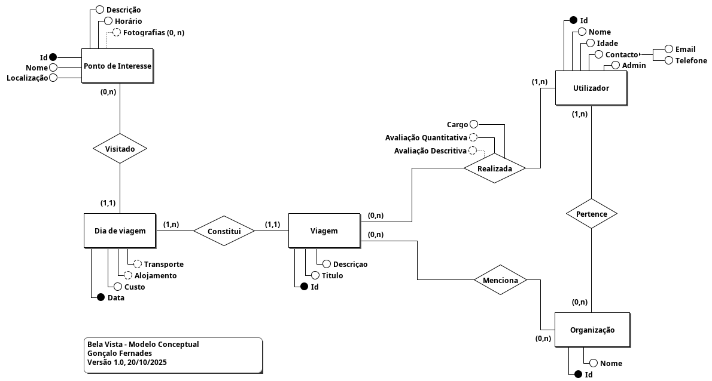
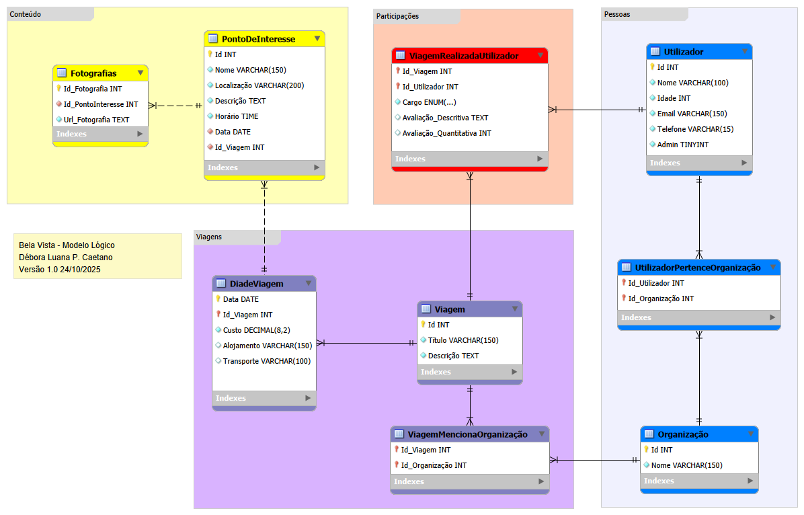

# bela-vista  <br>

Sistema de base de dados para catalogação de viagens virtuais, desenvolvido como projeto da disciplina de Bases de Dados.

## Modelo Conceptual



## Modelo Lógico



## Estrutura do projeto

```plaintext
bela-vista/
│
├── modelo-conceptual/
│   ├── ModeloConceptualBelaVista.brM3    
│   └── ModeloConceptualBelaVista.png     
│
├── modelo-logico/
│   ├── ModeloLógicoBV.png                
│   ├── ModeloLógicoBVAT.png              
│   └── ModeloLógicoBelaVista.mwb        
│
├── sql/
│   ├── creation.sql             
│   ├── indexes.sql               
│   ├── population.sql            
│   ├── procedures.sql            
│   ├── queries.sql               
│   ├── resumo.sql                
│   ├── transactions.sql          
│   ├── users.sql                
│   └── views.sql               
│
├── relatorio-bd.pdf             
└── README.md
```

##   Autores

**Débora Caetano** - [@deboravcaetano](https://github.com/deboravcaetano) <br>
**Gonçalo Fernandes** - [@gxnca](https://github.com/gxnca) <br>
**Enrico Prazeres** - [@enricoprazeres](https://github.com/enricoprazeres)

